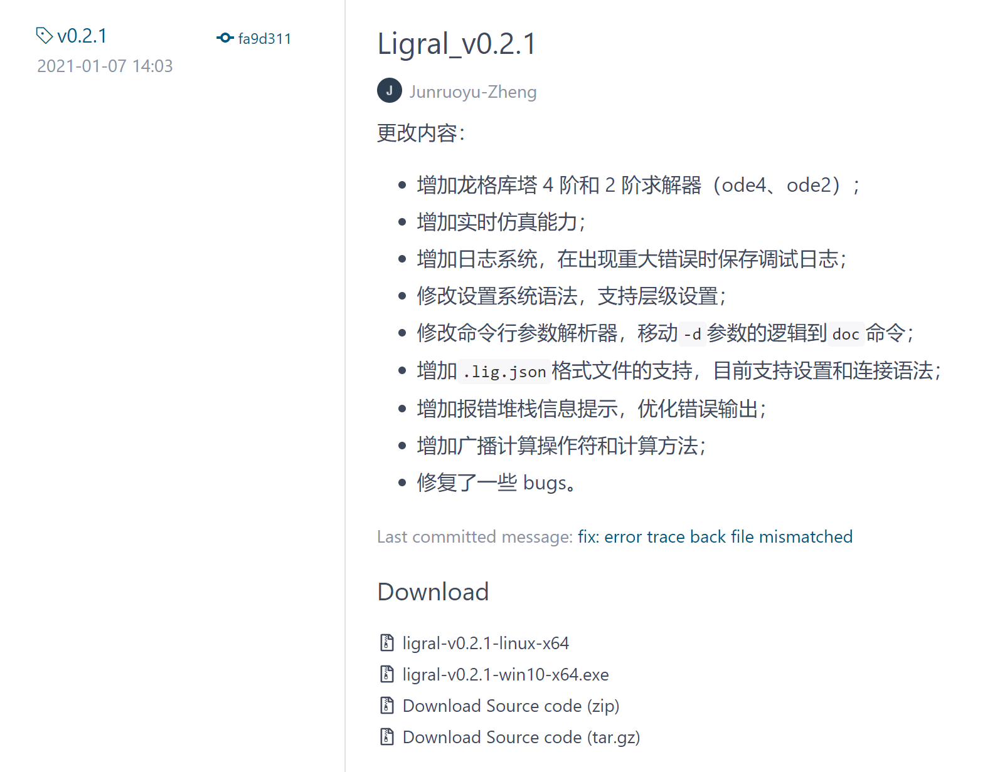
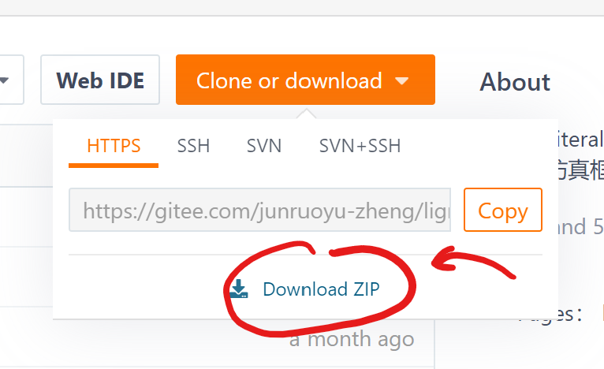
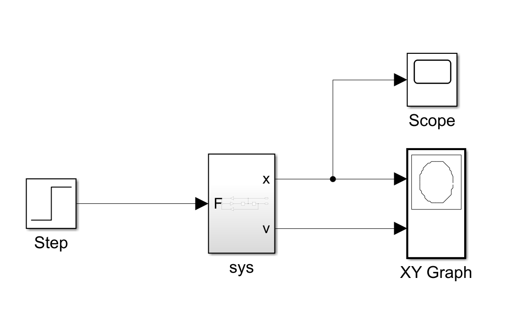
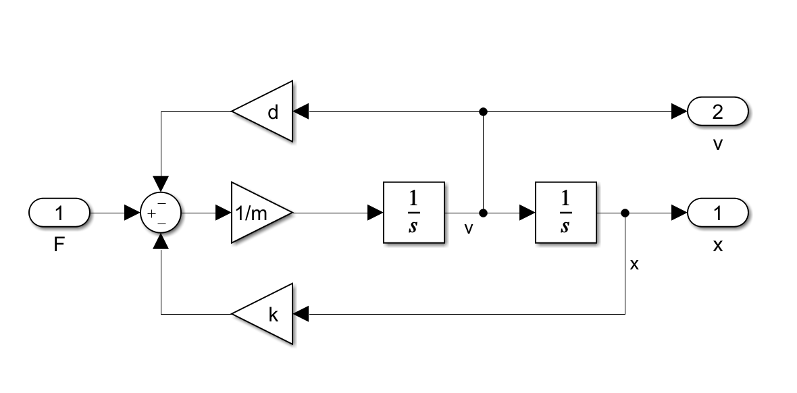
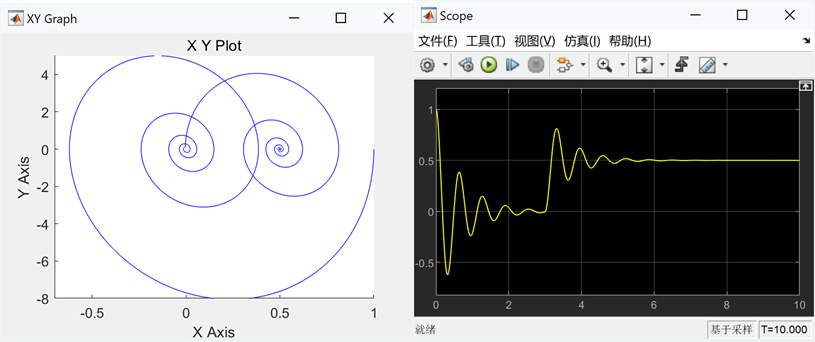

<!-- Copyright (C) 2019-2021 Junruoyu Zheng. Home page: https://junruoyu-zheng.gitee.io/ligral

     Distributed under MIT license.
     See file LICENSE for detail or copy at https://opensource.org/licenses/MIT
-->

# 快速开始

Ligral 基于 .NET core 3.1 开发，完美适配 .NET 5，可以运行在 Windows 和 Linux 系统上*（Windows 10 以及 Ubuntu 20、Debian 10 测试通过，Mac 系统尚未测试）*。只要简单几个步骤就可以让 Ligral 运行在自己的机器上，让我们马上开始吧！

## 下载安装

### 可执行程序

#### Windows 系统

目前，Ligral v0.2.1 发行版在 [Gitee](https://gitee.com/junruoyu-zheng/ligral/releases/v0.2.1) 和 [GitHub](https://github.com/jry-zheng/ligral/releases/v0.2.1) 开放下载。打开链接就可以看到打包好了的 ligral-v0.2.0-beta-win10-x64.exe。

下载到本地就可以运行了，但是十分建议您创建一个符号链接或者把可执行程序重命名为 ligral.exe，再把 ligral 所在文件夹添加到环境变量。具体操作为

- 按下开始建，输入控制面板；
- 在控制面板右上方搜索环境变量；
- 打开环境变量，在上方方框里找到 Path 变量；
- 双击打开，把 ligral 所在文件夹地址粘贴到新的一行；

此操作适用于 Windows 10 系统。如果您的操作系统是 Windows 7 或者更低版本，操作可能略有不同。

安装成功后，您可以在任意文件夹打开 cmd（强烈建议 Windows 10 用户下载安装 Windows Terminal），输入`ligral`，应当能看到如下输出：

    Copyright (c) Ligral Tech. All rights reserved.
                        __    _                  __
                       / /   (_)___ __________ _/ /
                      / /   / / __ `/ ___/ __ `/ /
                     / /___/ / /_/ / /  / /_/ / /
                    /_____/_/\__, /_/   \__,_/__/
                            /____/
    ----------------------------------------------------------------
    Hi, Ligral is a textual language for simulation.

    Usage:
        ligral main.lig         to parse and simulate main.lig project.
        ligral doc Node         to view the document of Node model.
        ligral doc              to view documents of all the models.

    Learn more:
        Visit https://junruoyu-zheng.gitee.io/ligral
        also available at https://JRY-Zheng.github.io/ligral

列举了一些常用的使用方法，更多命令请使用`ligral --help`命令查看。注意，如果您直接双击运行可执行程序，窗体只会一闪而过。

#### Linux 系统

Linux 版本的 ligral 也在 [Gitee](https://gitee.com/junruoyu-zheng/ligral/releases/v0.2.0-beta)  和 [GitHub](https://github.com/jry-zheng/ligral/releases/v0.2.0-beta) 上提供了。与 Windows 版本类似，您只要下载 ligral-v0.2.0-beta-linux-x64 即可使用。同样，建议您创建软连接 ligral 指向该程序，并且复制到`/usr/local/bin`文件夹下。

### 源码安装

无论是在 Windows 系统下还是 Linux 系统下，源码安装的方式都是一样的。首先，您需要下载安装 .NET core 3.1 开发工具包，即 SDK。不过下载 .NET 5 也是可以的，其性能更优，但是不是长期支持版本（LTS）。如果您的机器安装的是 Windows 系统，可以前往 [.NET 官网](https://dotnet.microsoft.com/download/dotnet-core)下载；Linux 上安装稍微复杂一些，但好在微软准备了一份[安装教程](https://docs.microsoft.com/zh-cn/dotnet/core/install/linux)。

如果您的机器已经安装好了 git，您可以打开终端，在准备存放 ligral 的文件夹运行以下命令（二选一）：

    git clone https://gitee.com/junruoyu-zheng/ligral.git
    git clone https://github.com/jry-zheng/ligral.git

然后切换到稳定的 master 分支。当然如果您愿意体验开发中的版本，也可以使用 dev 分支。切换到 master 的命令如下：

    git checkout master

如果没有安装 git，您可以去 [Gitee](https://gitee.com/junruoyu-zheng/ligral) 或者 [GitHub](https://github.com/jry-zheng/ligral) 网站上点击下载 ligral。以 Gitee 为例：

打开 ligral 文件夹后，在命令里运行：

    cd ligral
    dotnet build

如果您看到以下提示信息，说明以及编译成功了：

    Microsoft (R) Build Engine version 16.8.0-preview-20475-05+aed5e7ed0 for .NET
    Copyright (C) Microsoft Corporation. All rights reserved.

      Determining projects to restore...
      All projects are up-to-date for restore.
      You are using a preview version of .NET. See: https://aka.ms/dotnet-core-preview
      ligral -> C:\Users\zheng\Documents\ligral\bin\Debug\netcoreapp3.1\ligral.dll

    Build succeeded.
        0 Warning(s)
        0 Error(s)

    Time Elapsed 00:00:02.30

第一次编译可能需要进行还原（这些都是自动运行的），会需要较长的时间，视网络情况。编译成功后，建议把上面提示信息中“Build succeeded”上一行的文件所在文件夹添加到环境变量，具体操作参考上一节。

### 其他配置

#### Python 绘图工具包

由于 ligral 中的绘图模块依赖于 python3 的 matplotlib，因此如果您需要用到绘图时，还需要下载 python3，并且安装 numpy、matplotlib、pandas 三个包。目前暂不清楚对这三个包的最低版本要求是什么，但是较新版本都应是可用的。

Windows 系统可以从 [python 官网](https://www.python.org/downloads/windows/)下载，安装时最好把“添加到环境变量”；Linux 则一般自带 python，也可以通过命令安装（视系统不同选用的命令也可能不同）：

    sudo apt-get install python
    sudo yum install python

安装完 python 之后，确保 python 和 pip 都是可调用的，运行以下命令：

    pip install numpy
    pip install matplotlib
    pip install pandas

如果 pip 不可调用，可以使用 `python -m pip` 代替。如果网速较慢，可以在命令后面加上参数 

    pip install *** -i https://mirrors.cloud.tencent.com/pypi/simple

使用腾讯镜像。

如果您不需要用到绘图工具，仅需要将仿真的结果保存到 CSV 文件，您也可以忽略此步骤，程序仍然可以正确运行。

#### VSCode 语法高亮

在`plugins/vscode`文件夹下有一个`ligral`文件夹，包含了一个简单的 VSCode 插件，提供了 ligral 语言的语法高亮功能。如果您使用 VSCode 作为编辑器的话，可以将整个`ligral`文件夹复制到用户目录下的`.vscode/extensions`文件夹下，重启 VSCode 即可。

## 第一次运行

### Hello World!

安装完 ligral 之后，您可以尝试运行一些简单的“Hello World”程序。虽然 ligral 确实不能打印字符串，但是您也可以尝试以下最简单的仿真模型：

    conf step_size = 1;
    conf stop_time = 1;
    1 -> Print;

第一句和第二句命令，以`conf`为起始，表示这是配置命令。顾名思义，这两句的意思是设置仿真步长为 1（秒），仿真时长也为 1（秒）。这么做的目的是为了下一句打印语句不要出现得太多，如果没有的话不影响程序的运行。第三句也很简单，就是把一个常数 1 发送给打印输出模块`Print`。新建一个文件 test1.lig，输入以上内容并保存，在终端运行：

    ligral test.lig

您将看到以下输出：

    Time: 0.00       Print1 = 1
    Time: 1.00       Print1 = 1

这表明 ligral 程序已经正常工作了。

### 开始浏览 examples

您可以在 [Gitee](https://gitee.com/junruoyu-zheng/ligral) 或者 [GitHub](https://github.com/jry-zheng/ligral) 仓库的 examples 中找到一些简单的工程。比如 MassSpringDamper 工程，描述的是一个弹簧阻尼质量块系统。如果您学过自动控制原理，您应该很熟悉以下的框图：

其中 sys 是 Simulink 中的 SubSystem，双击进入后可以看到其内部结构为：

运行以上 Simulink 程序，得到的仿真结果是

在 ligral 中，与 SubSystem 相对应的概念是 route。在 MassSpringDamper 工程里，我们定义了这一模块，并且调用它生成实例（**这是 ligral 与 Simulink 最为不同的地方之一！**），得到相同的模型，代码如下：

    # 模块类名：MassSpringDamper
    # 参数：
    #     m： 质量
    #     k： 刚度
    #     d： 阻尼
    #     v0：初始速度
    #     x0：初始位置
    # 输入：
    #     F： 外部作用力
    # 输出：
    #     v：速度
    #     x：位置
    route MassSpringDamper(m, k, d, x0, v0; F; x, v)
        F-k*x-d*v -> Gain{value:1/m} -> Integrator{initial:v0} -> v;
        v -> Integrator{initial:x0} -> x;
    end

    # 定义一个 Step 信号
    Step[F]{start:3, level:5};

    # 实例化一个 MassSpringDamper 对象
    MassSpringDamper[sys]{m:0.1, k:10, d:0.3, x0:1, v0: 0};

    # 连接模块
    F -> sys;
    sys:x[position] -> Scope;
    (sys:x, sys:v[velocity]) -> PhaseDiagram;

其中`#`开头的语句是注释，执行中被忽略。更详尽的代码注释请看 examples 文件夹中的工程文件。您可以先尝试着复制这段代码粘贴到 test_msd.lig 文件中，并运行`ligral test_msd.lig`。您将看到这样的结果：

可以看到，ligral 求解该模型得到了和 Simulink 一样的结果。

## 结束

到此为止，恭喜您完成了快速开始的全部内容！需要继续深入了解 ligral 语法等问题，请看[用户指引](user-guide)。如果有问题，可以发 [Issue](https://gitee.com/junruoyu-zheng/ligral/issues) 或者[给我写信](mailto:zhengjry@outlook.com)。